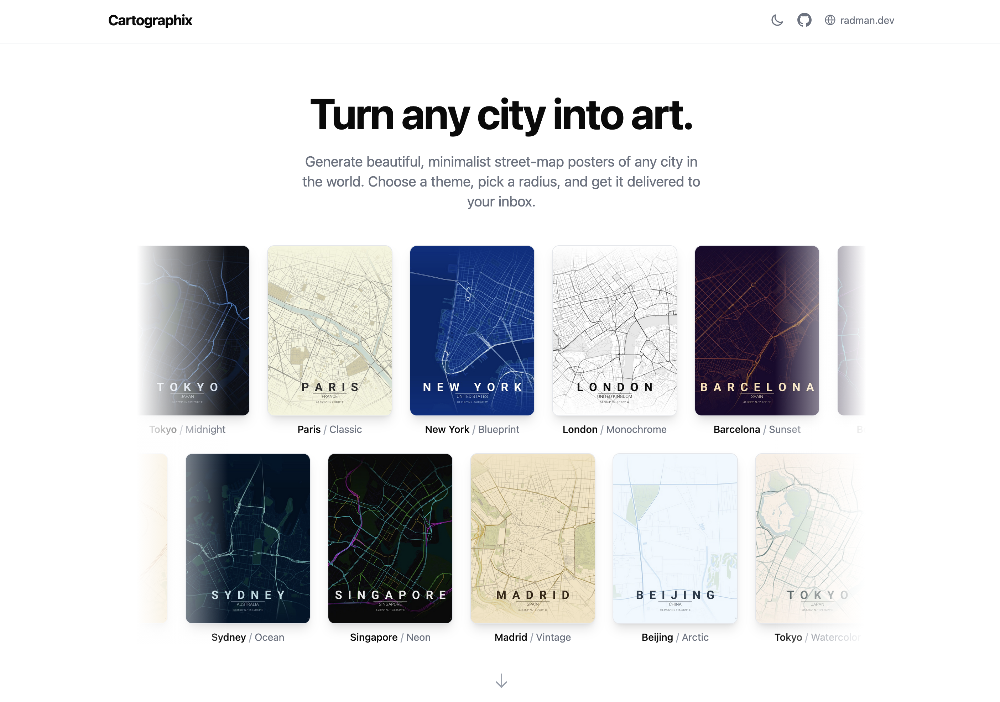
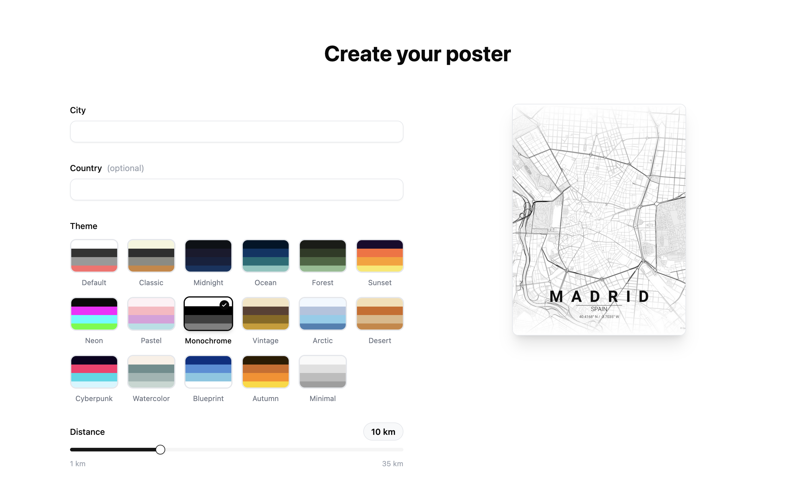

<p align="center">
  <h1 align="center">Cartographix</h1>
  <p align="center">
    Turn any city into art.
  </p>
  <p align="center">
    Generate beautiful, minimalist street-map posters of any city in the world.<br/>
    Choose a theme, pick a radius, and get it delivered to your inbox.
  </p>
  <p align="center">
    <a href="https://cartographix.radman.dev">Live App</a> · <a href="#features">Features</a> · <a href="#how-it-works">How It Works</a> · <a href="#themes">Themes</a> · <a href="#getting-started">Getting Started</a>
  </p>
</p>

---

<p align="center">
  
</p>

<p align="center">
  
</p>

---

Built with React, FastAPI, and OSMnx. Based on [MapToPoster](https://github.com/originalankur/maptoposter) by Ankur Kumar.

## Features

- **17 hand-crafted themes** — from Midnight and Neon to Watercolor and Blueprint, each with a distinct color palette
- **Real map data** — streets, rivers, parks, and coastlines pulled from OpenStreetMap via OSMnx
- **Live theme preview** — see a real poster update instantly as you browse themes
- **Multiple output formats** — Instagram square, mobile wallpaper, HD wallpaper, 4K, and A4 print
- **City autocomplete** — powered by Nominatim with instant suggestions as you type
- **Custom poster titles** — personalize with your own text or let it default to the city name
- **Landmark pins** — paste Google Maps or OpenStreetMap links to pin up to 5 landmarks
- **Adjustable radius** — control how much of the city to capture (1–35 km)
- **Email delivery** — optionally receive your poster via email so you don't have to wait
- **Poster gallery** — browse a library of pre-rendered posters while your map generates
- **Dark mode** — full light/dark theme support across the entire UI
- **Single container deploy** — one Docker image serves both the frontend and API

## How It Works

1. **Enter a city** — type a city name and select from autocomplete suggestions
2. **Pick your style** — choose from 17 themes and adjust the map radius
3. **Generate** — the backend geocodes the location, fetches streets and features from OpenStreetMap, and renders a high-resolution poster using matplotlib
4. **Download or receive by email** — your poster is ready in about a minute, displayed in-browser with a download button

## Themes

17 built-in themes, each defined by 4 colors (background, primary street, secondary street, accent):

`default` · `classic` · `midnight` · `ocean` · `forest` · `sunset` · `neon` · `pastel` · `monochrome` · `vintage` · `arctic` · `desert` · `cyberpunk` · `watercolor` · `blueprint` · `autumn` · `minimal`

## Stack

| Layer | Tech |
|-------|------|
| Frontend | React · Vite · TypeScript · Tailwind CSS · shadcn/ui · Framer Motion |
| Backend | FastAPI · Python 3.11+ · async background tasks |
| Poster Engine | OSMnx · Nominatim · matplotlib |
| Email | Resend API |
| Deploy | Docker (single multi-stage container) · Railway |

## Getting Started

### Prerequisites

- Python 3.11+
- Node.js 20+
- GDAL (`brew install gdal` on macOS)

### Backend

```bash
cd backend
python3 -m venv venv
source venv/bin/activate
pip install -r requirements.txt
python -m app.main
```

Runs on http://localhost:8000

### Frontend

```bash
cd frontend
npm install
npm run dev
```

Runs on http://localhost:5173 (proxies `/api` to backend)

### Or use the scripts

```bash
./run-backend.sh   # Terminal 1
./run-frontend.sh  # Terminal 2
```

### Docker

```bash
docker compose up --build
```

Builds frontend, installs geospatial deps, serves everything on port 8000.

## Environment Variables

| Variable | Required | Description |
|----------|----------|-------------|
| `RESEND_API_KEY` | No | Resend API key for email delivery |
| `ENVIRONMENT` | No | `development` or `production` |
| `PORT` | No | Server port (default: 8000) |

## License

MIT
